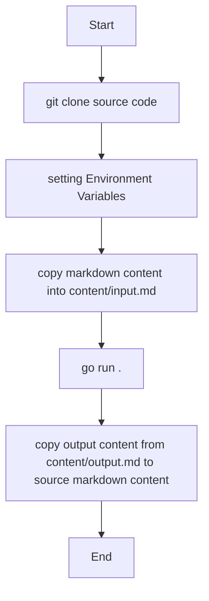

# mdimg_hosting

This program is used to assist in recording notes in markdown format.
The main function is to download and upload the images referenced in markdown to the specified image bed, and at the same time change the image address in batches.

本程序用来辅助记录markdown格式的笔记.
主要功能是将markdown中引用的图片下载并上传到指定图床,同时批量变更图片地址.

# Run

Environments
- `COS_BUCKETNAME`: 腾讯云COS存储桶名称 
- `COS_SECRETID`: 腾讯云访问凭证secretid
- `COS_SECRETKEY`: 腾讯云访问密钥secretkey

# TODO

support markdown content I/O ways:
- [x] local file

support image hosting service:
- [x] 腾讯云COS
- [ ] 七牛云
- [ ] GitHub

